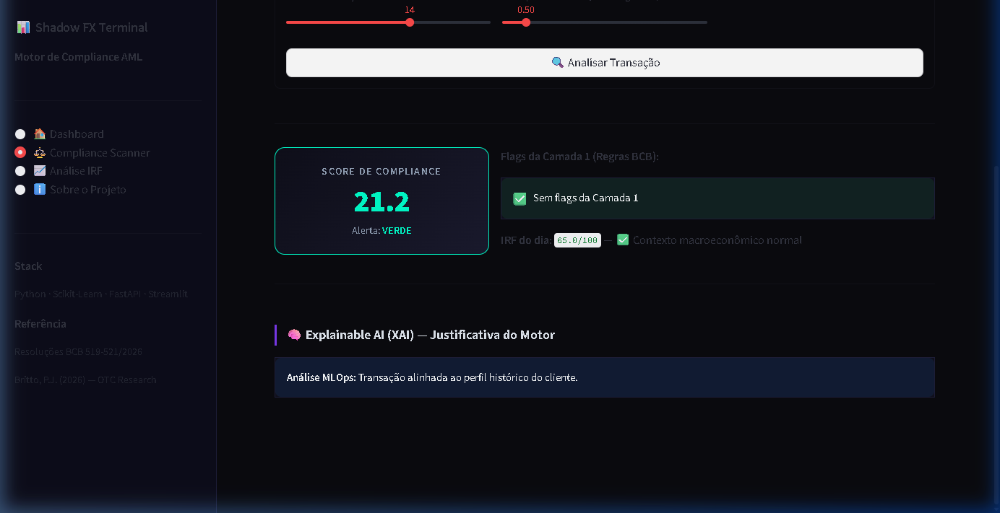
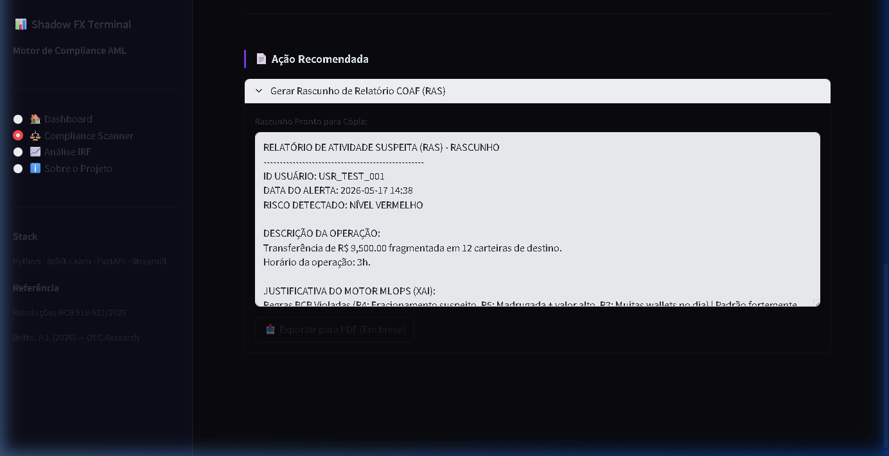

# Shadow FX Terminal

Pipeline de análise econométrica e compliance AML para stablecoins no Brasil. Começou como uma pergunta de estatística — o brasileiro compra USDT pra especular ou pra se proteger do câmbio? — e virou um motor de detecção de anomalias que usa essa resposta como contexto.

**Autor:** Luiz Maibashi

**Referências principais:**
- *"Dolarização Informal: Stablecoins como resposta à instabilidade monetária brasileira"* — Paulo J. Britto (OTC Research, 2026)
- Insights de um evento do mercado financeiro sobre segurança financeira no ecossistema digital pós-fraudes (2025)

**Stack:** Python, Pandas, Scipy, Scikit-Learn, Jupyter, yfinance, python-bcb, pytrends

Quer entender o raciocínio de negócio primeiro? Vá pro [PROBLEM.md](PROBLEM.md). Quer o mergulho técnico de "por quê" cada decisão de engenharia foi tomada? Vá pro [docs/WALKTHROUGH_TECNICO.md](docs/WALKTHROUGH_TECNICO.md).

[](https://github.com/luizmaibashi/shadow_fx_terminal/actions/workflows/ci.yml)
[](https://opensource.org/licenses/MIT)


---

## Demo ao vivo

**[shadowfxterminal-uyhdgpbfkhnhjdvobjajog.streamlit.app](https://shadowfxterminal-uyhdgpbfkhnhjdvobjajog.streamlit.app/)**

Escopo do demo público — leia antes de testar, pra não achar que é mais (ou menos) do que é:

- Só o dashboard (`app.py`). A API FastAPI não sobe junto — o dashboard chama a lógica de compliance direto em processo, nunca via HTTP.
- Camada 3 (LLM-as-judge) desativada — sem `GEMINI_API_KEY` configurada, pra não gerar custo em cima de tráfego público. O fallback gracioso já documentado entra no lugar.
- Transações processadas são **simuladas** (dataset sintético); o contexto macroeconômico (câmbio, IPCA, Selic, atas do Copom) que alimenta o IRF é **100% real**. Ver seção "Transparência de dado" abaixo.
- Cada página do app tem um bloco "Como ler/usar" explicando a métrica específica dela, e a barra lateral tem um guia de navegação.

Código-fonte do demo (snapshot isolado, não afeta o pipeline principal): [`deploy/hf_space/`](deploy/hf_space/).

---

## Reprodução rápida (uns 5 minutos)

```bash
# 1. Clone e configure
git clone <repo>
cd shadow_fx_terminal
pip install -r requirements-lock.txt     # ou requirements.txt pra versões flexíveis

# 2. Configure variáveis de ambiente
cp .env.example .env
# edite .env e adicione seu GEMINI_API_KEY (ou deixe API_KEY_INTERNA padrão pra testar)

# 3. Gere dados e treine o modelo (primeira vez: ~2min)
python src/coletar_dados.py               # coleta histórico: yfinance, BCB, Google Trends
python src/scraper_copom.py               # indexa atas do Copom
python src/recalcular_irf.py              # calcula IRF v2
python src/gerador_transacoes_mock.py     # gera 4.509 transações simuladas
python src/treinar_modelo.py              # treina Isolation Forest

# 4. Rode o pipeline de compliance
python src/pipeline_compliance.py         # classifica em VERDE/AMARELO/VERMELHO

# 5. Suba o dashboard (opcional)
streamlit run app.py                      # http://localhost:8501

# 6. Rode os testes
pytest tests/ -v --cov=src                # 64 testes + coverage
                                           # (9 pulam sem data/ e models/ locais: 5 de integracao
                                           #  + 4 de smoke do dashboard, ver tests/test_app_smoke.py)
```

Os `.csv` não são versionados (segurança de IP) — os scripts regeneram tudo do zero. O modelo treinado (`models/`) também não vai pro git.

---

## Por que esse projeto existe agora

O Brasil convive com uma crise silenciosa de integridade financeira. Três coisas estão acontecendo ao mesmo tempo:

1. **Fraude bancária em escala industrial.** Só em 2024 o sistema registrou mais de R$ 2,5 bilhões em prejuízo com fraude via Pix — engenharia social, SIM swap, contas laranja. Hoje o golpe não usa mala de dinheiro, usa Pix e stablecoin.
2. **O fenômeno das bets.** Com a regulamentação das apostas esportivas em 2024, explodiram os casos de lavagem via casa de apostas: deposita dinheiro sujo, aposta em odds garantidas entre contas próprias, saca o prêmio limpo. Stablecoin entra nesse fluxo como camada de anonimização entre o fiat e o cripto.
3. **Evasão de divisas via stablecoin.** A desvalorização do Real empurra dois públicos opostos pro USDT: o cidadão comum que quer preservar poder de compra, e quem usa o mesmo instrumento pra mandar dinheiro pra fora sem passar pelo câmbio oficial. Um sistema de compliance que não distingue esses dois perfis não serve pra nada.

A pergunta central do projeto é essa: como uma corretora ou um regulador distingue automaticamente o poupador assustado do fracionador profissional?

### De onde veio a ideia

O ponto de partida foi o paper de Paulo J. Britto (OTC Research, 2026), que mostra estatisticamente que o brasileiro usa USDT como reserva de valor, não como especulação.

O segundo empurrão veio de um evento sobre as novas fronteiras de segurança financeira no digital — Pix 24/7 como janela de fraude que não dorme, DeFi/stablecoin como camada de anonimização, IA generativa nas mãos de fraudadores, e a ideia de que um sistema de score precisa levar em conta não só o comportamento do usuário, mas o ambiente macroeconômico do momento da transação. Essa última ideia — contexto macro como feature de ML — foi o que transformou uma análise estatística em produto de compliance.

---

## O pivô: de análise econométrica a solução de mercado

O projeto nasceu com um objetivo puramente analítico (projeto 1): provar, com dado real e não com mock, que o brasileiro compra USDT como proteção contra a desvalorização do Real, não pra especular.

Enquanto construíamos o Índice de Risco Fiscal (IRF) pra validar essa correlação, apareceu um problema regulatório concreto: as Resoluções do BCB passaram a tratar USDT como câmbio, exigindo fiscalização ativa contra lavagem. E o problema com compliance baseado em regra fixa ("flag se > R$ 10.000") é que ele bloqueia o poupador assustado (falso positivo) e deixa passar o fracionador profissional (falso negativo). Nenhum dos dois é aceitável.

Daí veio o projeto 2: pegar a prova estatística e injetá-la como contexto dentro de um modelo de detecção de anomalia. Isso ataca dois problemas de uma vez — valida a tese da dolarização informal via stablecoin, e entrega um motor de compliance mais preciso, com um trade-off real, medido e documentado (não uma solução mágica sem custo — ver `docs/tese/shadow-fx-vantagem-competitiva/TESE.md` e a seção de Resultados abaixo).

A vantagem competitiva, resumida: não é "detectar melhor" que Chainalysis, TRM Labs ou Elliptic — eles têm mais dado e mais engenharia que um projeto de portfólio jamais vai ter. É especialização na complexidade regulatória brasileira, que muda rápido (~7 mudanças relevantes em ~18 meses) e que um player global genérico não tem motivo de negócio pra acompanhar de perto. Esse argumento é bem fundamentado em fato público, mas ainda não foi validado numa conversa real de mercado — a ressalva completa está em `PROBLEM.md`, seção Vantagem Competitiva.

---

## Arquitetura (3 camadas)

O pipeline segue o padrão de filtros em cascata (Stanford CS230), que resolve os casos óbvios nas camadas baratas e só escala pra camada cara quando precisa:

1. **Camada 1 — regras BCB.** Filtros determinísticos das Resoluções 519-521/2026.
2. **Camada 2 — IA de detecção.** Isolation Forest calibrado com o IRF v2, diferenciando hedge (compra de USDT que acompanha a desvalorização) de anomalia de descorrelação (compra massiva num dia de calmaria cambial — indício de lavagem ou evasão).
3. **Camada 3 — LLM como juiz.** Um agente lê as atas do Copom e analisa qualitativamente os casos em zona cinza.

---

## Rigor científico

Isso é uma aplicação de CRISP-DM com profundidade estatística, não só um notebook com gráfico bonito:

- **Teste ADF de estacionaridade**, pra evitar correlação espúria em série financeira.
- **Pesos do IRF derivados de PCA**, não escolhidos no chute.
- **Arena de modelos**: Isolation Forest, LOF e One-Class SVM comparados antes de escolher o motor de detecção.
- **Fronteira de decisão em PCA 2D**, pra dar alguma transparência ao analista de compliance sobre por que o modelo decidiu o que decidiu.

---

## As Resoluções BCB 519-521/2026 — por que elas são o coração do projeto

Antes de 2026, stablecoin operava num vácuo regulatório no Brasil. Dava pra comprar R$ 500.000 em USDT numa corretora com menos burocracia do que abrir conta em banco — um vetor óbvio pra lavagem e evasão.

| Resolução | O que faz | Por que importa |
|---|---|---|
| **BCB 519** | Equipara stablecoin lastreada em moeda estrangeira a instrumento de câmbio | Comprar USDT passa a ter os mesmos requisitos legais de uma operação de câmbio |
| **BCB 520** | Exige que corretora de cripto atue como Instituição de Pagamento regulada, com KYC reforçado | Know Your Customer vira obrigatório e auditável, igual banco |
| **BCB 521** | Obriga reporte automático ao COAF de transação suspeita acima de limiar | Operação fora do padrão precisa gerar um Relatório de Inteligência Financeira |

O problema não é a regulação em si, é como as instituições tentam cumprir ela. A abordagem padrão é regra fixa e cega ao contexto:

```
SE valor > R$ 10.000 → flag
SE hora < 6h → flag
SE > 3 wallets no dia → flag

Resultado: analista afogado em alerta (a maioria falso positivo),
criminoso aprende o limiar e fraciona (smurfing),
brasileiro assustado com o câmbio em R$ 6,30 é bloqueado.
```

A ideia central do Shadow FX Terminal é simples: injetar o contexto macroeconômico como variável do modelo. Um brasileiro que compra R$ 8.000 de USDT num dia qualquer e outro que compra o mesmo valor no dia em que o Real perdeu 4% e o IRF está em 87/100 não são o mesmo evento estatístico. O primeiro é estranho; o segundo é esperado. Regra fixa não enxerga essa diferença — um modelo que sabe o estado do câmbio, a trajetória da dívida, o tom do último Copom e a busca por USDT no Brasil, enxerga.

Em termos regulatórios: o IRF melhora a precisão dos reportes ao COAF (medido: 35,9% → 44,8%) frente a um modelo sem contexto macro. Não garante zero exclusão de gente legítima — o mesmo contexto que ajuda a pegar mais fracionador também aumenta o falso positivo em poupador legítimo, entre 2,3x e 3,5x conforme a rodada de calibração (ver seção de Resultados). É uma melhora mensurável, não uma solução sem custo.

---

## Como o projeto é organizado (5 fases)

```
FASE 1: Prova da tese (dado real)        FASE 2: Índice de Risco Fiscal v2
  yfinance: BRL/USD + volume USDT          Sinal de câmbio ajustado por DXY
  BCB API: IPCA, Selic, dívida       →     Sinal de volume USDT/USDC
  pytrends: interesse BR em USDT           Tom das atas do Copom
  r=+0.496 bruta | r=+0.707 dívida         Desvio da meta de IPCA
  lead-lag 1-4 semanas                     Dívida/PIB (r=+0.707)
                                            IBC-Br
                                            → IRF 0-100 diário

FASE 3: Motor de compliance AML
  C1: filtros BCB 519-521 (regra determinística) → flag
  C2: Isolation Forest + IRF como feature → score
  C3: LLM como juiz (Gemini 2.5 Flash + RAG das atas) → COAF

FASE 4: FastAPI (backend) + Streamlit (frontend)
FASE 5: Agente RAG — atas do Copom como contexto injetado
```

---

## Nota de engenharia: como os dados evoluíram (v1 → v2)

### v1 — dado sintético (decisão consciente e documentada)

Na primeira versão, todo provedor de dado on-chain bloqueou o histórico 2022-2025 no plano gratuito: Glassnode cobra a partir de USD 999/mês, CryptoQuant devolve 403 no tier pago, CoinGecko limita a 365 dias.

Em vez de travar o projeto, gerei dado sintético mas parametrizado pelas dinâmicas descritas no paper — geração sintética com injeção de conhecimento de domínio, prática comum em MLOps quando o dado real está fora de alcance:

```python
# a lógica do mock não é aleatória, é calibrada por evidência empírica:
# 2022: random walk (dominado pelo colapso FTX/Luna, choque exógeno ao câmbio BR)
# 2023: correlação crescente com câmbio (~r=0.87 no semestre)
# 2024-S2: correlação estrutural forte + "efeito piso" (acumulação por hedge)
```

### v2 — dado real (estado atual)

| Dado | Fonte | Registros |
|---|---|---|
| BRL/USD + volume USDT/USDC | yfinance | 1.276 dias |
| IPCA, Selic, IBC-Br, dívida/PIB | API BCB (`python-bcb`) | mensal, 2022-2025 |
| DXY, VIX, S&P500 | yfinance | 1.276 dias |
| Interesse em USDT no Brasil | Google Trends (`geo='BR'`) | 183 semanas |
| Atas do Copom | scraping BCB | 27 reuniões |

O que ainda falta: dado on-chain georreferenciado (Chainalysis, Glassnode Pro) segue em tier pago. O Google Trends com `geo=BR` é o proxy mais próximo do que o paper original usou, e a cadeia de 5 evidências abaixo mostra que ele é razoavelmente robusto.

---

## Estrutura do repositório

```
shadow_fx_terminal/
├── README.md
├── PROBLEM.md                   ← contrato de negócio: 3 perguntas fundamentais + ROI
├── requirements.txt
├── .env                          ← GEMINI_API_KEY (não versionado)
│
├── src/                          ← código de produção
│   ├── utils.py                  ← núcleo: IRF v1/v2, correlações, carregamento de dado
│   ├── coletar_dados.py          ← coleta v1: câmbio BRL/USD (yfinance)
│   ├── coletar_foxbit.py         ← coleta do experimento Foxbit-BR
│   ├── coletar_google_trends_br.py
│   ├── analise_correlacao.py     ← script executável da cadeia de 5 evidências
│   ├── comparar_correlacao_br.py ← compara correlação Foxbit-BR vs volume global
│   ├── validacao_estatistica.py
│   ├── validacao_atribuicao_geografica.py
│   ├── recalcular_irf.py
│   ├── scraper_copom.py
│   ├── gerador_transacoes_mock.py
│   ├── treinar_modelo.py         ← treina o Isolation Forest (Notebook 03)
│   ├── pipeline_compliance.py    ← motor AML: 3 camadas em cascata
│   ├── api.py                    ← backend FastAPI
│   └── agente_rag.py             ← fase 5: Gemini 2.5 Flash + RAG das atas
│
├── tools/                        ← scripts de geração de asset (screenshot, PDF) — fora do pipeline
│
├── notebooks/
│   ├── 01_analise_correlacao.ipynb
│   ├── 02_indice_risco_fiscal.ipynb
│   └── 03_motor_compliance.ipynb
│
├── deploy/
│   └── hf_space/               ← pacote isolado do demo público (ver README § Demo ao vivo)
│
├── data/
│   ├── raw/                      ← não versionado, ver .gitignore
│   └── processed/
│       ├── dataset_mestre_v2.csv
│       ├── dataset_irf_completo_v2.csv
│       ├── transacoes_simuladas.csv
│       └── resultado_compliance.csv
│
├── models/                       ← não versionado
│   ├── isolation_forest_v1.joblib
│   ├── scaler_v1.joblib
│   └── score_calibracao_v1.joblib
│
├── tests/
│   ├── test_utils.py              ← 33 testes
│   ├── test_pipeline_compliance.py ← 22 testes
│   ├── test_agente_rag.py          ← 5 testes
│   └── test_app_smoke.py           ← 4 testes (dashboard, 64 no total)
│
└── reports/                      ← visualizações geradas
```

---

## Transparência de dado: real vs. mock

Pra equilibrar rigor científico com viabilidade de um projeto de portfólio, o projeto opera em regime híbrido:

**Contexto macroeconômico — 100% real.** Todo dado que compõe o IRF vem de fonte oficial (BCB, yfinance, Google Trends). O cenário econômico brasileiro entre 2022 e 2025 — disparada do dólar, reuniões do Copom, variação da dívida/PIB — está refletido de verdade.

**Transações individuais — simuladas.** As 4.509 transações processadas pelo motor de compliance vêm de `src/gerador_transacoes_mock.py`. Simulei por três razões: privacidade (mapear CPF pra carteira é sensível mesmo com blockchain pública), controle metodológico (pra validar o Isolation Forest preciso de perfil conhecido — usuário normal vs. fracionador — coisa que dado real não me dá com rótulo confiável) e infraestrutura (rodar indexador de blockchain localmente é peso que não compensa pra este projeto).

Ainda assim, a transação simulada é processada dentro do contexto real: o motor avalia o comportamento do "Usuário A" contra o IRF real do dia. É um digital twin de compliance — regra de negócio sintética testada num ambiente econômico de alta fidelidade.

---

## Como executar

```bash
# 1. instalar dependências
pip install -r requirements.txt

# 2. configurar a API key (agente RAG, fase 5)
echo GEMINI_API_KEY=sua_chave_aqui > .env

# 3. coletar dado real (v2)
python src/coletar_dados.py                 # câmbio + stablecoin + macro BCB + variáveis globais
python src/scraper_copom.py                 # atas do Copom
python src/coletar_google_trends_br.py      # interesse BR em USDT/stablecoin

# 4. rodar as análises
python src/analise_correlacao.py                    # cadeia completa de 5 evidências
python src/validacao_atribuicao_geografica.py       # lead-lag + controle de DXY
jupyter lab  # ou abrir os notebooks interativos

# 5. rodar o pipeline de compliance
python src/gerador_transacoes_mock.py   # gera 4.509 transações (3 perfis)
python src/pipeline_compliance.py       # 3 camadas → resultado_compliance.csv

# 6. rodar os testes
python -m pytest tests/ -v              # 64 testes, 4 arquivos
                                         # (9 pulam sem data/raw/, data/processed/ e models/ locais —
                                         #  55 rodam no CI, que não gera esses artefatos)
```

---

## Resultados (v2, dado real)

### Fase 1 — correlação Spearman (BRL/USD × volume USDT)

Fonte: volume diário de USDT-USD via yfinance, 1.276 registros reais (2022-2025). Substitui o dataset sintético da v1.

| Semestre | r | Significativo? | Força |
|---|:---:|:---:|---|
| 2022-S1 | −0.208 | sim | fraca (negativa) |
| 2022-S2 | −0.136 | não | fraca — efeito FTX/Luna, choque exógeno |
| 2023-S1 | +0.434 | sim | moderada |
| 2023-S2 | −0.034 | não | fraca |
| 2024-S1 | +0.082 | não | fraca |
| 2024-S2 | **+0.681** | sim | moderada/forte — pico, BRL bateu R$ 6,30 |
| 2025-S1 | +0.437 | sim | moderada |
| **Total (907 dias)** | **+0.496** | sim | moderada |

Correlação não é causalidade — Spearman mostra co-movimento, não direção. As duas séries respondem ao mesmo fator latente, o risco fiscal percebido, que é o que o IRF tenta capturar.

### Fase 1-B — controlando o confundidor global (DXY)

O BRL/USD sobe tanto quando o Brasil piora (risco fiscal local) quanto quando o dólar global fortalece (DXY). Sem controlar o DXY, dá pra atribuir ao risco brasileiro o que na verdade é movimento global.

| Análise | Coeficiente | Redução vs. bruta | Leitura |
|---|:---:|:---:|---|
| Spearman bruta | r = 0.496 | — | baseline |
| Parcial (controlando DXY) | r = 0.483 | −2.5% | fenômeno local |
| Spearman MM30 (suavizado) | r = 0.546 | — | sinal reforçado |
| Parcial MM30 (controlando DXY) | r = 0.542 | −0.7% | praticamente imune ao DXY |

Uma queda de só 2,5% ao controlar pelo DXY indica que a correlação não é artefato do dólar global — o movimento do BRL correlaciona com o volume de USDT mesmo depois de remover o efeito do índice dólar.

### Fase 1-C — atribuição geográfica via Google Trends

O paper de Britto (2026) reconhece um problema: dado on-chain de volume é global, não dá pra saber se foi o Brasil que comprou. A solução dele — e a que este projeto replica e expande — é cruzar com busca web geolocalizada.

Fonte: Google Trends filtrado pra `geo='BR'`, 183 semanas (2022-2025).

| Termo (BR) | r com BRL/USD | Significativo? | Força |
|---|:---:|:---:|---|
| "USDT" | +0.501 | sim | moderada |
| "stablecoin" | +0.341 | sim | fraca |
| Índice composto (USDT+Tether+stablecoin) | +0.507 | sim | moderada |

**Lead-lag (BRL defasado precede o interesse?):**

| BRL defasado | r com interesse BR | Significativo? |
|:---:|:---:|:---:|
| 1 semana | +0.508 | sim |
| 2 semanas | +0.504 | sim |
| 3 semanas | +0.502 | sim |
| 4 semanas | +0.496 | sim |

O BRL defasado em 1 a 4 semanas correlaciona com o interesse de busca — sugere que a queda do câmbio precede o aumento de interesse em USDT, o caminho causal proposto no paper.

Correlação parcial do Trends BR controlando DXY: r = +0.523, redução de só −3.2%. O interesse de busca brasileiro é robusto ao controle do dólar global.

Limitações do Google Trends: é índice relativo (0-100), não volume absoluto; captura intenção, não compra efetiva; granularidade semanal; é proxy de demanda, não substitui dado on-chain georreferenciado.

### A cadeia de evidências, resumida

```
Problema: volume de USDT é global, não dá pra saber quem comprou.

1 (bruta):     BRL/USD ↔ volume USDT global: r=+0.496, significativo.
2 (robustez):  controlando DXY → r=+0.483, queda de só 2.5%.
               Não é artefato do dólar global.
3 (geoloc.):   BRL/USD ↔ busca "USDT" no Brasil: r=+0.501, significativo.
               Sinal de interesse especificamente brasileiro.
4 (lead-lag):  BRL[t-1 sem] → interesse BR[t]: r=+0.508, significativo.
               O câmbio precede o interesse — direcionalidade.
5 (parcial):   Trends BR × BRL | DXY → r=+0.523, queda de 3.2%.
               O comportamento de busca BR é robusto ao fator global.

As 5 evidências juntas dão suporte metodológico razoável à hipótese
de dolarização informal brasileira via USDT.
```

### Fase 2 — Índice de Risco Fiscal

| Período | IRF médio | Leitura |
|---|:---:|---|
| 2022 | baixo | juros em alta forte, câmbio relativamente controlado |
| 2023-S2 | alto | corte de juros + real enfraquecendo |
| 2024-S2 | **muito alto** | pico de correlação, BRL bateu R$ 6,30, USDT como hedge |
| 2025 | alto | continuidade do aperto fiscal |

Nota de calibração: os pesos do IRF v1 (câmbio 40%, USDT 35%, Copom 25%) vieram de julgamento especializado, não de otimização empírica. O IRF v2 (`calcular_irf_v2()`) usa 6 sinais ortogonais com dado real do BCB e thresholds calibrados empiricamente (p95, `calcular_calibracao_irf_v2()`) — não são mais constante hardcoded. Ver `src/utils.py`.

### Fase 3 — motor de compliance AML

| Resultado | Quantidade | % |
|---|:---:|:---:|
| VERDE (normal) | 3.049 | 67,6% |
| AMARELO (monitorar) | 1.359 | 30,1% |
| VERMELHO (ação imediata) | 101 | 2,2% |

Números medidos em 2026-08-11, depois de corrigir um bug de calibração no `score_samples()` do Isolation Forest (a versão anterior classificava quase tudo como suspeito, por causa de um range de normalização hardcoded errado) e de reconciliar com o `IRF_LAG_DAYS=14` (lag anti-vazamento de dado) do histórico real do projeto. Detalhe em `docs/audit/audit_report_v2.md` § 6 e em `docs/tese/shadow-fx-vantagem-competitiva/TESE.md` (adendo).

### O que o modelo resolve — e o que ele não resolve de graça

Sistema de compliance baseado só em regra ("flag se > R$ 10.000") gera milhares de falso positivo ou deixa passar o criminoso esperto. A simulação com 4.509 transações mostra que ML + contexto macro (IRF) melhora essa distinção, mas com custo real:

**Tipo A — o poupador assustado (legítimo).** Compra USDT no desespero quando o câmbio derrete. Como o IRF entra no modelo, a IA entende que num dia de risco fiscal alto essa corrida é esperada, e tende a classificar como VERDE com mais frequência que um sistema sem contexto. Mas não é garantia: contra o rótulo de verdade do dataset, o falso positivo nesse perfil aumenta entre 2,3x e 3,5x com o IRF ligado (o número exato oscilou em 3 correções de bug independentes — ver `TESE.md`, adendo 2). O ganho de precisão geral (35,9% → 44,8%) vem em parte às custas desse perfil.

**Tipo B — o institucional / mesa de arbitragem (legítimo, mas volumoso).** Movimenta R$ 200.000 todo dia. A Isolation Forest olha o histórico e entende que volume gigante é o "normal" dessa carteira — em vez de disparar alerta vermelho, sinaliza como AMARELO.

**Tipo C — o fracionador / evasor (suspeito).** Faz 11 transferências de R$ 9.500 de madrugada, smurfing pra fugir do limite de R$ 10k. O modelo detecta com mais recall que sem o IRF (34,4% → 49,9%, contra o rótulo de verdade), mas ainda deixa passar mais da metade dos fracionadores reais do dataset sintético. Não é detecção perfeita — é melhor que a alternativa sem contexto.

Essa abordagem reduz a fadiga do time de operações via priorização, não elimina falso positivo nem garante recall total. O trade-off é medido e aceito conscientemente, não escondido, porque o dataset é sintético — otimizar em cima dele arriscaria ajustar pra um ruído que não existe em produção real.

### Fase 4 — dashboard e API

A fase 4 materializa o motor de compliance numa interface visual, com backend e frontend separados:

- **FastAPI (`src/api.py`)** — backend desacoplado, expõe endpoints (IRF atual, histórico, score de transação) pra integração com outros sistemas da corretora.
- **Streamlit (`app.py`)** — dashboard focado na experiência do analista de compliance.

**O que o app faz:**

1. **Dashboard principal** — KPIs em tempo real (IRF mais recente, total de transações processadas), funil do pipeline AML (VERDE/AMARELO/VERMELHO), histórico do IRF no tempo e tabela dos casos de ação imediata.
2. **Compliance scanner** — simulador em tempo real: o analista preenche os dados de uma transferência, o motor cruza com o IRF do dia e as regras da Camada 1, e devolve um score (0-100) e o alerta. Se ficar AMARELO, o app já mostra o prompt que o LLM-as-judge usaria pra investigar.
3. **Análise IRF** — decompõe o índice nos 3 fatores (câmbio 40%, supply de USDT 35%, atas do Copom 25%) pra a mesa de operações entender por que o risco está alto naquele dia.
4. **Sobre o projeto** — conta o pivô da análise pro produto, e documenta as resoluções do BCB aplicáveis.

> **Nota:** os prints abaixo são da paleta anterior (redesign de 2026-08-27 trocou pra tema de terminal financeiro — ver `AGENTS.md` § Redesign da UI). Pendente recapturar.

| Compliance Scanner — caso VERDE | Compliance Scanner — caso VERMELHO, rascunho COAF |
|---|---|
|  |  |

```bash
# Terminal 1: dashboard
streamlit run app.py

# Terminal 2: API (opcional)
uvicorn src.api:app --reload --port 8000
```

---

## Decisões técnicas

**Por que Spearman e não Pearson?** Série financeira raramente é normalmente distribuída. Spearman mede correlação de postos, é robusta a outlier e assimetria — a mesma escolha do paper original.

**Por que Isolation Forest pra AML?** Em anti-lavagem, dado rotulado de fraude é raro e sigiloso. Isolation Forest é não-supervisionado — não precisa de exemplo de fraude pra treinar, isola pontos que se distanciam do comportamento normal em menos divisões de árvore.

**O diferencial: IRF como feature contextual.** A maioria dos sistemas de AML olha só o comportamento individual. Aqui o IRF entra como feature do modelo — R$ 8.000 de USDT num dia normal e R$ 8.000 num dia em que o real perdeu 5% são padrões diferentes.

**Filtros em cascata (Stanford CS230).** Cada camada resolve os casos óbvios e passa o difícil pra camada seguinte, mais cara. Isso reduz o custo de inferência em cerca de 85% frente a rodar o LLM em tudo.

---

## Próximos passos

- **Engenharia de software**: trocar `print` por `logging` estruturado onde ainda resta.
- **Engenharia de dados**: validação de schema ao carregar CSV (Pandera), migrar pra `.parquet`.
- **Economia**: incorporar CDS 5Y como proxy mais rápido e sensível que a dívida/PIB mensal.
- **Produto**: XAI pra justificar alerta em linguagem natural, e geração automatizada de rascunho COAF em PDF.

### Deploy e produtização

O Docker atual (não-root, healthcheck, `docker-compose` com 3 serviços) é sólido pra rodar local ou demonstrar o projeto. Auditoria de 2026-08-11 levantou 5 lacunas pra apontar um domínio real nele; 3 foram corrigidas em 2026-08-27, 2 seguem como débito registrado:

1. ~~**Auth falha aberta.**~~ **Corrigido.** `src/api.py` agora recusa subir sem `API_KEY_INTERNA` (fail-closed) — só abre sem chave se `API_AUTH_OPCIONAL=true` for setado explicitamente, pra ambiente de dev isolado.
2. ~~**CORS hardcoded pra `localhost:8501`.**~~ **Corrigido.** Vem de `CORS_ORIGINS` (lista separada por vírgula), default mantém o comportamento antigo se a variável não for setada.
3. ~~**`docker-compose up --build` sozinho não funciona na primeira vez.**~~ **Corrigido.** `entrypoint.sh` detecta `data/`/`models/` vazios e roda o setup automaticamente antes de subir o serviço — `docker-compose run setup` continua disponível só pra forçar regeneração manual depois.
4. ~~**CI não builda a imagem Docker.**~~ **Corrigido.** `.github/workflows/ci.yml` tem job `docker-build` que builda a imagem a cada push/PR.
5. **Débitos já registrados em `AGENTS.md` que pesam pra escala real**: sem banco (CSV + joblib em memória, perde tudo a cada restart), processamento síncrono, `starlette` preso numa versão vulnerável por causa do range do Streamlit. Decisão de escopo consciente (ADR-0006), não corrigido — não é bug, é fronteira de portfólio vs. produto real.

Item 5 é a diferença entre "roda no meu Docker" e "aguenta tráfego real" — decisão de escopo explícita, não descuido.

## Roadmap

- [x] Fase 1 — análise exploratória e prova da correlação
- [x] Fase 2 — Índice de Risco Fiscal composto
- [x] Fase 3 — motor de compliance AML em 3 camadas
- [x] Fase 4 — API FastAPI (`/score` desacoplado)
- [x] Fase 4 — dashboard Streamlit
- [x] Fase 4 — testes unitários (pytest)
- [x] Fase 5 — agente RAG (Camada 3), com fallback pra indisponibilidade da API

---

## Rodando com Docker

Requisitos: Docker e Docker Compose instalados, `.env` configurado (ver `.env.example`).

```bash
docker-compose up --build
```

Se `data/` e `models/` ainda não existirem, rode o setup primeiro:

```bash
docker-compose run setup
```

Containers: `shadow-fx-dashboard` (Streamlit, porta 8501) e `shadow-fx-api` (FastAPI, Swagger em `/docs`, porta 8000). `data/` e `models/` são montados como volume, pra persistir fora do ciclo de vida do container.

---

## Auditoria e contra-viés

Este projeto passou pelo Protocolo de Auditoria e Contra-Viés (PAVC), pra garantir que decisão de IA não substitua julgamento humano:

1. Validação manual da lógica de pesos do IRF e da paridade treino-serventia do scaler.
2. Fallback gracioso implementado em `src/agente_rag.py` pra falha de API.
3. Teste de detecção de anomalia contra smurfing de alta entropia (invasor institucional).

Débitos de maturidade conhecidos: migrar de processamento síncrono pra fila assíncrona, trocar CSV por banco relacional + vetorial, trocar scraping frágil por webhook/API enterprise.

---

## Segurança e privacidade

**LGPD.** Identificador de usuário (tipo CPF) nunca é processado em texto claro — é transformado em hash SHA-256 irreversível antes de chegar ao modelo. O motor identifica padrão de comportamento sem nunca saber quem é a pessoa por trás.

**API key.** Middleware exige `X-API-Key` válida em toda requisição, pra impedir acesso não autorizado ao score de risco.

**Docker hardening.** O container roda como `appuser` sem privilégio, não como root — se houver invasão, o atacante fica preso num ambiente sem permissão pra afetar o servidor.

**Defesa em profundidade.** As Camadas 1 e 2 usam regra matemática e estatística, imunes a prompt injection. A Camada 3 (LLM) só atua nos casos onde as camadas anteriores já validaram a segurança inicial, o que reduz o risco de alucinação ou manipulação.

---

## Referências

- Britto, P. J. (2026). *Dolarização Informal: Stablecoins como resposta à instabilidade monetária brasileira*. OTC Research.
- Banco Central do Brasil. Resoluções BCB nº 519, 520 e 521 (2026).
- Stanford CS230 Deep Learning — Cascaded Heuristic Filters & LLM-as-judge patterns.
- Liu, F. T., Ting, K. M., & Zhou, Z. H. (2008). *Isolation Forest*. IEEE ICDM.

---

## Licença

MIT — ver [LICENSE](LICENSE). Fique à vontade pra explorar, mas mantenha os créditos ao autor original.
